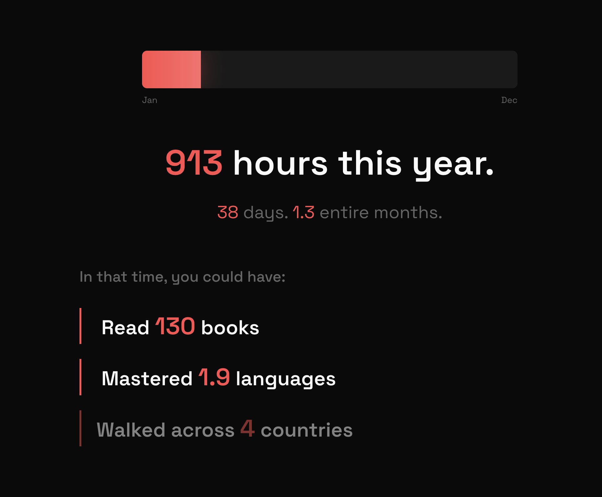

# Gaze

An interactive web experience that visualizes how much of your life you spend on social media.



## What it does

Gaze takes you through a scrolling journey that makes abstract time tangible:

1. **The Clock** - Drag to set your daily social media hours
2. **Time Breakdown** - See your usage extrapolated to weekly, monthly, and yearly totals
3. **Opportunity Cost** - Discover what you could accomplish with that time (books read, languages learned, countries walked across)
4. **Life Perspective** - Enter your age to see your remaining life visualized as a grid of weeks
5. **The Silhouette** - Watch as a human figure fills up, representing the portion of your remaining life spent scrolling
6. **Reclaim** - Use the slider to see how reducing usage gives you years back

## Tech Stack

- Vanilla HTML/CSS/JavaScript
- [GSAP](https://greensock.com/gsap/) with ScrollTrigger for scroll-based animations
- SVG graphics for the clock and silhouette visualizations
- Space Grotesk font

## Running Locally

Just open `index.html` in a browser. No build step required.

```bash
# Or use a local server
npx serve .
# or
python -m http.server 8000
```

## Inspiration

Inspired by interactive storytelling from [The Pudding](https://pudding.cool/) and the "life in weeks" visualization from [Wait But Why](https://waitbutwhy.com/2014/05/life-weeks.html).

## License

MIT
